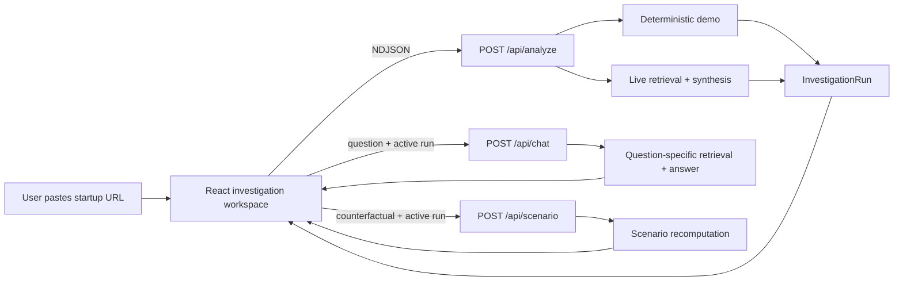
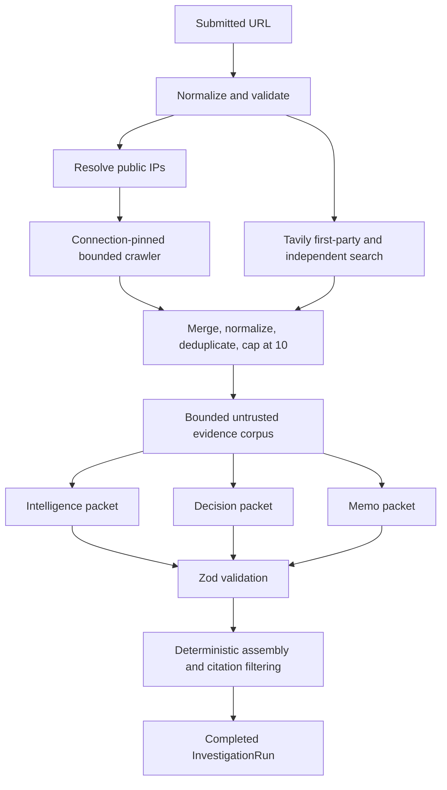
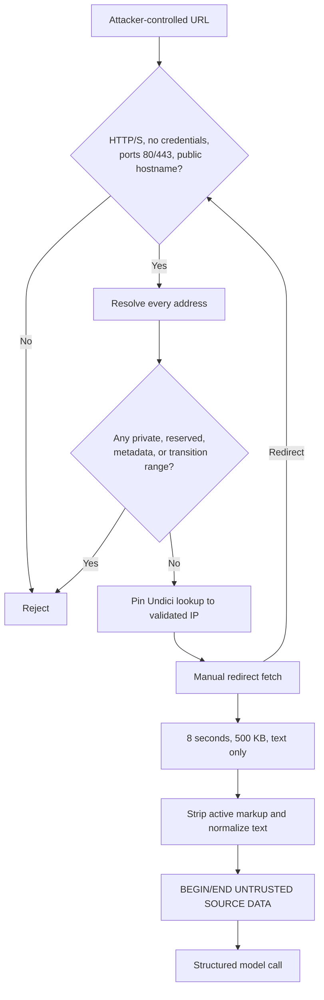
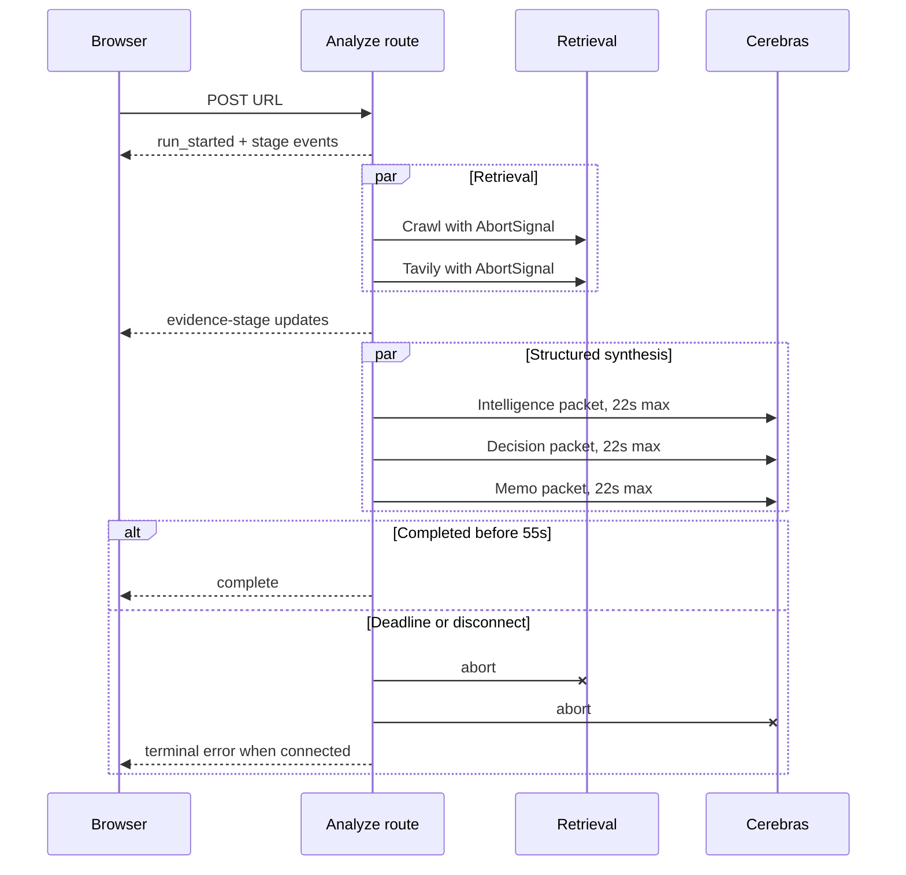
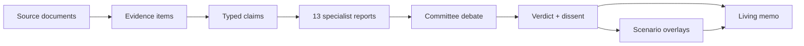
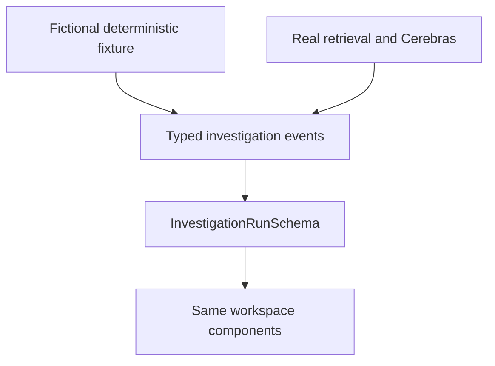

# StartupSignal V2 — Presentation Guide

Updated for the production-hardening review · 2026-07-15
Purpose: a complete, deliberately over-stuffed presentation kit: narrative, slide-by-slide outline, architecture diagrams, talking points, demo script, tradeoffs, numbers to quote, and Q&A prep. Cut it down to fit your time slot; every section marks what to keep if you are short.

---

## 0. How to use this document

- **Sections 1–3** give you the story (what, why, how) — this is the spine of any version of the talk.
- **Section 4** is the slide-by-slide outline with speaker notes. A full run is ~25–30 minutes; the "⏱ short version" tags mark the 10-minute cut.
- **Section 5** is a live demo script with fallbacks.
- **Section 6** is the technical deep-dive material (use for engineering audiences or appendix slides).
- **Section 7** is anticipated Q&A with suggested answers.
- **Section 8** lists concrete numbers and phrases worth quoting verbatim.

**One-sentence pitch to memorize:**
> "StartupSignal turns any startup URL into an evidence-backed venture investigation — a committee of AI specialists that shows its sources, admits what it doesn't know, and lets you stress-test its verdict."

---

## 1. WHAT it is

StartupSignal V2 is a Next.js web application that takes a single input — a startup's website URL — and produces:

1. **A bounded evidence corpus** — up to 4 directly crawled pages from the company site plus up to 6 indexed sources from Tavily search (first-party and independent), every one URL-validated, byte-capped, and provenance-labeled.
2. **13 specialist agent reports** — discovery, product, founders, technology, market, competition, customers, business model, momentum, risk, bull case, bear case, and a committee chair. Each report carries findings, typed claims, risks, explicit unknowns, and a confidence score.
3. **An investment committee verdict** — 4 committee statements with preserved dissent, a recommendation on a 6-point scale (Strong Invest → Strong Pass, plus *Insufficient Evidence*), conviction/confidence/coverage percentages, 8 scored dimensions, and 3 probability scenarios with ranges and horizons.
4. **A living investment memo** — a printable IC memorandum with an executive summary, thesis, 6 evidence-cited sections, a methodology footer, and a change log that grows as you run counterfactuals.
5. **A counterfactual lab** — "assume a major platform launches a competing product" → the committee recomputes the verdict without inventing new evidence, and the memo logs the change.
6. **A research channel** — a contextual chat bound to the active company. Every question triggers fresh question-specific retrieval, and every answer returns confidence, assumptions, unknowns, cited evidence, and (for forecast questions) an explicit probability range with a horizon and basis.

It ships with two modes:
- **Demo mode** — a deterministic, explicitly fictional company ("Heliograph") with zero API keys and zero network calls. Same UI, same data contract.
- **Live mode** — real crawling, real search, real model synthesis on Cerebras.

**What it is NOT (say this out loud — it builds credibility):** it is not a prediction engine and not investment advice. Every run carries the warning "Structured model judgment only; not investment advice." The product's core bet is that *showing uncertainty honestly* is more valuable than pretending to certainty.

---

## 2. WHY this design makes sense

This is the heart of the talk. Each decision below pairs a problem with the chosen answer. These make great individual slides.

### 2.1 Why "evidence before opinion"
LLMs will happily fabricate funding rounds, customer counts, and founder bios. StartupSignal's answer is structural, not aspirational:
- Every claim is **typed** (`observed_fact`, `source_claim`, `inference`, `estimate`, `assumption`) and must reference supplied evidence IDs.
- The server **deletes citations the model invents** — evidence-ID filtering happens in deterministic code after generation, not in the prompt.
- Unknown facts must be labeled *Unknown*; each of the 13 agents has a curated fallback "unknown" if the model omits one.
- Company-authored pages are labeled first-party *source claims*, never "verified facts," and the prompt forbids describing company-controlled URLs as independent reporting.

### 2.2 Why a committee instead of a score
A single number invites false confidence. A committee with preserved dissent invites interrogation:
- 4 committee statements with stances (positive/neutral/negative) and an `isDissent` flag that the UI renders in red — dissent is a first-class product feature.
- The verdict schema *requires* a dissent string and unanswered diligence questions — the model literally cannot return a verdict without stating what would change its mind.
- Probabilities are **ranges with horizons and movers**, labeled "RANGES, NOT FORECASTS" in the UI.

### 2.3 Why Cerebras
- Live synthesis is the latency bottleneck: three structured completions over a multi-thousand-token corpus. Cerebras inference is extremely fast, which turns a "submit and come back" workflow into an interactive one.
- Cerebras supports **strict JSON-schema decoding**, which pairs with the app's Zod-everywhere philosophy: the provider constrains generation, then Zod independently re-validates. Two locks, different keys.
- Constraint that shaped the architecture: Cerebras caps strict schemas at **5,000 characters**. The full investigation schema is far larger — so the design splits it into **three concurrent packets** (intelligence / decision / memo) that each fit, then deterministically reassembles them. Concurrency also means the wall-clock cost is one call, not three.

### 2.4 Why Tavily alongside a direct crawler
- A crawler alone sees only what the company says about itself. Tavily adds **two deterministic searches**: one restricted to the company's domain (indexed first-party pages the crawler didn't reach) and one for independent evidence with social/UGC domains excluded (reddit, LinkedIn, X, TikTok, etc.).
- It's also the **resilience path**: many startup sites block bots (403/429). When that happens, the crawler falls back to public XML sitemaps (metadata only) while Tavily recovers substantive evidence. If *nothing* substantive comes back, deterministic code — not the model — forces the verdict to *Insufficient Evidence* with floor-level confidence.

### 2.5 Why the security posture is unusually heavy for a demo app
The app fetches attacker-controlled URLs from a server — that's an SSRF machine unless you engineer otherwise:
- URL normalization: HTTP/S only, no credentials, ports 80/443 only, blocked hostname suffixes (`.internal`, `.local`, metadata hostnames).
- DNS resolution with a private/reserved/link-local/transition/metadata denylist for both IPv4 and IPv6. Every direct HTTP connection is **pinned to the exact public IP that passed validation**, closing the DNS-rebinding gap; redirects are normalized, resolved, validated, and pinned again.
- Bounded everything: 3 redirects, 8s per request, 4 pages, 500 KB retained per page, text content types only.
- Fetched HTML is made inert (scripts/styles/iframes/SVG/forms stripped via cheerio) before it ever reaches a prompt, and it enters the prompt fenced as `BEGIN/END UNTRUSTED SOURCE DATA` with `<`/`>` escaped.
- The system prompt establishes instruction hierarchy: web content is data, never instruction — prompt injection from a crawled page is treated as a *when*, not an *if*.

### 2.6 Why demo mode is deterministic and fictional
- **Zero-friction first impression**: no keys, no network, works offline, never rate-limited, never slow.
- **Honesty**: it's explicitly fictional (Heliograph), badged "Fictional demo data" throughout, so nobody mistakes canned data for analysis of a real company.
- **Engineering value**: demo and live emit the same event stream and the same `InvestigationRun` contract, so the entire UI is exercised without spending a cent — it doubles as an integration fixture and an incident fallback.

### 2.7 Why NDJSON streaming instead of a spinner
A 30–60 second black box feels broken. The analyze route opens a newline-delimited JSON stream immediately and emits typed events (`run_started`, `stage`, `evidence`, `agent`, `committee`, `complete`, `error`) validated by a shared Zod discriminated union. The user watches a 15-stage pipeline light up, evidence accumulate in a rail, and committee statements arrive — the *process* is the UI.

### 2.8 Why "living memo" + counterfactuals
Real investment memos are documents people argue with. The scenario lab makes that a feature: counterfactuals are **assumption layers** applied to the existing validated verdict — the model is explicitly forbidden from inventing new evidence — and each one appends to the memo's change log. The memo you print reflects the arguments you had with it.

---

## 3. HOW it was built (the story to tell)

Structure this as "constraints first, then architecture followed."

1. **Started from a contract, not a UI.** The core artifact is one Zod schema — `InvestigationRunSchema` — that both demo and live paths must satisfy. Everything else (events, routes, components) derives from it. ~200 lines of schema define the entire product surface.
2. **Treated the provider as untrusted too.** Model output goes through strict schema decoding *and* independent Zod re-validation, with exactly one time-bounded repair retry that receives the failing validation paths before failing cleanly. Tavily responses get their own Zod contract. Nothing external is believed on arrival.
3. **Let the 5,000-char schema limit drive decomposition.** Rather than fighting the constraint, the investigation was partitioned into three packets that run concurrently — which *improved* latency and made deterministic reassembly (fixed IDs, fixed counts, placeholder backfill) a natural checkpoint.
4. **Made failure modes product features.** Bot-blocked site → sitemap fallback → forced *Insufficient Evidence* if nothing substantive survives. The sitemap-only path now skips model inference entirely. Truncated page → a visible coverage warning attached to the run. Failed extraction → downgraded reliability label ("low") instead of silent acceptance. The warnings array rides inside the run and renders in the UI.
5. **Kept the serverless envelope honest.** One bounded request (`maxDuration = 60`) with an application deadline at 55 seconds, cancellation propagated to crawling, Tavily, and Cerebras, in-memory best-effort rate limiting, and no database. The README says exactly what broader production would add: durable queues, persistent runs, and distributed rate limiting.
6. **Tested the risky seams.** 60 Vitest tests target exactly where damage would occur: the SSRF guard, IPv6 transition ranges, crawler parsing (robots, charsets, sitemaps, bounded reads), the Tavily response contract, the Zod→JSON-schema converter, citation sanitizing, and the schemas themselves.

**Stack summary (one slide):** Next.js 16 App Router · React 19 · strict TypeScript · Tailwind CSS 4 + Motion · Cerebras Cloud SDK (Chat Completions, strict JSON schema) · Tavily Search/Extract REST · Zod 4 · Cheerio · Undici · Vitest. Deployed on Vercel with one required live-synthesis key and one strongly recommended retrieval key.

---

## 4. Slide-by-slide outline (with speaker notes)

### Slide 1 — Title ⏱ short version
**"StartupSignal — Turn any startup URL into an evidence-backed investigation."**
Sub: An AI investment committee that cites sources, preserves dissent, and admits what it doesn't know.
*Notes:* Open with the problem in one breath: "Early-stage diligence is hours of tab-hopping, and asking a chatbot gets you confident fiction. I built the middle path."

### Slide 2 — The problem ⏱ short version
- Manual diligence: slow, unstructured, repetitive.
- Raw LLM: fast, but invents funding rounds and can't say *why* it believes anything.
- The gap: **traceability**. Who said this, where, and how sure are we?
*Notes:* This frames every architecture decision as a traceability decision.

### Slide 3 — What you get (product tour, screenshots) ⏱ short version
One row each: pipeline view → verdict → decision matrix → probability ranges → memo → scenario lab → research channel.
*Notes:* Don't explain mechanics yet. Sell the artifact: "a printable IC memo where every section carries its citations."

### Slide 4 — Live demo ⏱ short version
(See Section 5 for the script. If time-boxed, demo here and let questions drive the rest.)

### Slide 5 — System architecture ⏱ short version
Use the top-level diagram from `claude_arch_diagram.md` (Section 1). Callouts:
- Browser owns state; server owns secrets, crawling, and providers.
- Three API routes: `/api/analyze` (NDJSON stream), `/api/scenario`, `/api/chat`.
- Demo and live converge on one validated contract.

### Slide 6 — The evidence pipeline
Flow: URL → SSRF guard → (crawler ∥ Tavily) → merged, deduped, capped corpus → 3 concurrent Cerebras packets → Zod → assembled run.
*Notes:* Emphasize the parallel branches — crawl and search run concurrently via `Promise.allSettled`, so either can fail without killing the run.

### Slide 7 — Why a committee, not a score
- 13 specialists → 4 committee statements → 1 verdict, with dissent preserved and rendered.
- Verdict schema *requires* dissent + unanswered questions.
- 6-point recommendation scale includes *Insufficient Evidence* as a first-class outcome.
*Notes:* "The most honest output this system produces is a refusal to conclude."

### Slide 8 — Trust boundaries (security)
Use the trust-boundary diagram (Section 4 of `claude_arch_diagram.md`). Three sound bites:
- "Everything fetched is attacker input: DNS-checked, byte-capped, stripped inert, and fenced as untrusted data."
- "The model is also untrusted: strict decoding, then independent Zod re-validation, then evidence-ID filtering in code."
- "Even the client re-validates the finished run before rendering it."

### Slide 9 — The 5,000-character constraint (engineering story)
- Cerebras strict schemas cap at 5,000 chars; the investigation schema is much bigger.
- Solution: partition into intelligence / decision / memo packets, run concurrently, reassemble deterministically with fixed IDs and placeholder backfill.
*Notes:* This is your best "constraint shaped the architecture" moment — engineers love it.

### Slide 10 — Failure is a feature
- 403/429 homepage → sitemap metadata fallback → deterministic *Insufficient Evidence* lock with **no model call** if nothing substantive survives.
- Malformed model output → exactly one bounded repair attempt → clean typed error.
- Every degradation becomes a visible warning inside the run, not a log line.

### Slide 11 — The research channel
- Chat bound to the active company (pronouns resolve to it).
- Each question: 2 fresh Tavily searches → ≤4 new sources → structured answer with confidence, assumptions, unknowns, evidence IDs.
- Forecast questions must return a probability *range* + horizon + basis; the server strips citations that don't match supplied evidence.

### Slide 12 — By the numbers
Pull from Section 8. (Bounded corpus caps, 13/4/8/3 packet counts, 46 tests, 2 env vars, 15-stage pipeline.)

### Slide 13 — Honest limitations ⏱ short version
Straight from the README: single bounded request, no persistence, in-memory rate limiting, 4-page crawl ceiling, retrieval ≠ verification. Then the roadmap: durable queues, stored runs, distributed limits, richer connectors.
*Notes:* Presenting limitations yourself defuses the hardest questions and signals engineering maturity. Mention that independent reviews identified DNS pinning, timeout budgets, cancellation, citation integrity, and scenario-baseline issues, and that those changes are now implemented. Durable persistence remains the important next architectural step.

### Slide 14 — Close ⏱ short version
Repeat the one-liner. End on the philosophy: **"The product's job is not to be right — it's to be checkable."**

---

## 5. Demo script (~4 minutes)

**Setup beforehand:** dev server running, `.env.local` loaded, one live run *pre-completed in another tab* as a fallback, browser zoomed for projection.

1. **Landing (15s).** Read the headline. Point at the two paths: real URL vs. fictional demo.
2. **Start a live run (30s).** Paste a real, crawl-friendly startup URL. As it starts: "The server just validated this URL against private networks and cloud metadata endpoints — this app is an SSRF machine unless you engineer otherwise."
3. **Narrate the stream (60s).** Pipeline stages lighting up; evidence rail filling ("each card is a validated URL with a reliability grade and a bounded excerpt"); active-agent mandate view; committee statements arriving — find a dissent if one appears.
4. **Verdict tab (45s).** Recommendation + conviction/confidence/coverage meters. Point at "RANGES, NOT FORECASTS" and the preserved-dissent block. "The schema forces the model to tell you what would change its mind."
5. **Stress test (45s).** Run "Assume growth stalls for twelve months." Show deltas and the memo change log entry. "No new evidence invented — the committee recomputed under an assumption layer."
6. **Research channel (45s).** Ask "What are the odds they raise a Series B in 18 months?" Show the probability card, assumptions, unknowns, cited sources. "The forecast has a horizon and a basis, and every citation was checked server-side."
7. **Memo (20s).** Open, scroll, hit Print preview. "This is the artifact: a memo with a source appendix and a change log."

**Fallbacks:** if live fails on stage → switch to the pre-completed tab ("here's one I ran earlier"). If network is fully down → demo mode, and spin it as the point: "deterministic, keyless, same contract — that's the resilience story."

---

## 6. Technical deep dives (appendix / engineering audiences)

### 6.1 The structured-output call path
`callCerebrasStructured` (lib/ai/cerebras.ts): Zod schema → `z.toJSONSchema` → strip unsupported keys (`pattern`, `minItems`, `format`, …) → close every object with `additionalProperties: false` → assert ≤5,000 chars → strict decode at temperature 0.15 with a 22-second limit → parse+Zod → on failure, ONE repair at temperature 0.1 with `strict: false`, a 14-second limit, and the first failing Zod paths → Zod again → typed error naming the failing path. Key line for the audience: *relaxed constraints go to the provider; the original Zod schema stays authoritative.*

### 6.2 Deterministic assembly
The model never controls identity: agent IDs (`product-agent`), claim IDs, committee slots, score labels, evidence IDs (`ev-live-N`) are all assigned server-side. Missing packet entries are backfilled with honest placeholders ("No supported score was returned", confidence 0). Exact counts (13/4/8/3) are enforced *after* generation, so the provider schema stays small.

### 6.3 The sitemap-only lock
If every source is a sitemap catalog, the orchestration short-circuits before Cerebras. It creates a deterministic skeleton, then `constrainSitemapOnlyAnalysis` locks every workstream to the narrow fact that published paths exist, verdict → *Insufficient Evidence*, all scores neutralized to 50 with floor confidence, and the memo rewritten to "Unknown" sections. The model is not invoked, so there is no opinion to override and no wasted inference spend.

### 6.4 Citation hygiene in chat
Answer text supports single and multi-ID citation brackets, removes unsupported evidence IDs, and preserves ordinary prose such as `[low confidence]`. The returned evidence list is the intersection of declared + inline IDs with the valid set; the sources array includes only actually-cited items. Three independent checks work against citation hallucination.

### 6.5 Testing philosophy
60 tests aimed at the blast-radius seams: `url.test.ts` (SSRF matrix: mapped/compressed IPv6, NAT64, 6to4, Teredo, numeric IP forms, metadata hostnames), `crawler.test.ts` (bounded reads, charset decoding, robots groups/wildcards/Allow rules, sitemap parsing), `tavily-contract.test.ts`, `cerebras-schema.test.ts` (schema conversion + size cap), `research-chat-citations.test.ts`, and schema tests. The UI and event protocol are exercised end to end through the deterministic demo path.

---

## 7. Anticipated Q&A

**"How do you stop the model from making things up?"**
Three layers: provider-side strict schema decoding; server-side Zod re-validation plus code that deletes any evidence citation not in the supplied set; and a prompt contract that types every claim and requires *Unknown* labels. Can it still be wrong? Yes — which is why every claim is traceable to a URL you can open.

**"What about prompt injection from a crawled page?"**
Assumed, not hoped against: HTML is stripped inert, fenced as untrusted data with angle brackets escaped, and the system prompt sets an explicit instruction hierarchy. Even if injection alters the output, it must fit the strict schema, pass Zod, and survive citation filtering. The demo path is fully immune (no network).

**"Why Cerebras and not OpenAI/Anthropic?"**
Speed and structured output. Interactive multi-agent synthesis needs low latency; Cerebras inference speed makes three concurrent structured completions feel instant. Architecturally the provider is behind one helper function — swapping is a contained change.

**"Is this investment advice?"**
No, and the product says so on every run. It's diligence *support*: it accelerates evidence gathering and structures judgment, and it deliberately preserves uncertainty rather than laundering it into a confident number.

**"What breaks at scale?"**
Known and documented: single-request execution (needs durable queues), no persistence (runs die on refresh), per-instance rate limiting (needs KV), per-question search cost (needs quotas). The README's limitations section is the honest roadmap.

**"How accurate is it?"**
Reframe: accuracy isn't the claim — *traceability* is. Every conclusion links to evidence with reliability grades, coverage percentages, and explicit unknowns. When evidence is thin the system says *Insufficient Evidence* instead of guessing — arguably its most important behavior.

**"What was the hardest part?"**
The 5,000-character strict-schema ceiling. It forced packet decomposition, which cascaded into concurrent calls, deterministic reassembly, and placeholder backfill — the constraint ended up producing a better architecture than the unconstrained design would have.

**"Has anyone reviewed the security?"**
Yes. Two independent review passes (`Claude_suggestions_v1.md` and `AG_suggestions_v1.md`) examined the crawler, trust boundaries, streaming lifecycle, model contracts, and client state. Their concrete findings drove DNS connection pinning, IPv6 hardening, a 55-second deadline, disconnect propagation, run gating, memo citation filtering, security headers, robots upgrades, and scenario baseline fixes. Server-side run persistence remains the durable next step because follow-on APIs currently revalidate a client-carried run rather than loading it by ID.

---

## 8. Numbers & phrases to quote

**Numbers:**
- 1 URL in → 13 specialist reports, 4 committee statements, 8 scored dimensions, 3 probability scenarios, 6-section memo.
- Evidence caps: ≤4 crawled pages · 500 KB/page · ≤6 Tavily sources · ≤10 merged · 3 redirects · 8s per fetch.
- 3 concurrent Cerebras packets, each under a 5,000-character strict-schema limit; exactly 1 repair attempt.
- 15-stage visible pipeline · 60 tests · 1 required live key + 1 recommended search key · 60-second serverless budget with a 55-second application deadline.
- Chat: ≤8 history turns, ≤500-char questions, ≤4 fresh sources per question.

**Phrases:**
- "Evidence before opinion."
- "A committee, not a score."
- "Fetched content is untrusted data, never model instruction."
- "The model is also untrusted — strict decoding, then independent validation."
- "Ranges, not forecasts."
- "Failure modes are product features."
- "The most honest output is a refusal to conclude."
- "The product's job is not to be right — it's to be checkable."

---

## 9. Suggested cuts by time slot

- **5 min:** Slides 1–4 (pitch + demo) + Slide 14. Let Q&A pull in architecture.
- **10 min:** add Slides 5, 7, 13 (architecture, committee rationale, limitations).
- **20 min:** add Slides 6, 8, 9, 10 (pipeline, security, schema constraint, failure design).
- **30 min / engineering:** everything + Section 6 deep dives as appendix slides.

---

## 10. Choose the narrative for your audience

The same product should not be presented the same way to every room. Pick one primary narrative and let the other material support it.

### 10.1 Investor or venture audience

**Lead with:** the broken diligence workflow and the quality of the final decision artifact.

**Spend time on:**
- Why a committee with dissent is more credible than a single AI score.
- Evidence provenance, explicit unknowns, and the printable memo.
- The scenario lab and contextual research channel.
- The demo, especially a question that cannot be answered from the company website alone.

**Keep technical detail to:** one architecture slide and one trust slide.

**Best closing line:** "StartupSignal compresses the first pass of diligence without compressing away uncertainty."

### 10.2 Engineering or architecture audience

**Lead with:** a deceptively hard systems problem: accept an attacker-controlled URL, retrieve public evidence, call multiple AI providers, stream partial state, and still fit inside a 60-second serverless envelope.

**Spend time on:**
- DNS validation plus connection pinning.
- Schema partitioning around the 5,000-character provider limit.
- Abort propagation and terminal stream semantics.
- Deterministic assembly, evidence-ID filtering, and the sitemap-only short circuit.
- Why the system is an orchestrated workflow rather than an uncontrolled multi-agent loop.

**Best closing line:** "The AI is probabilistic; the workflow around it is deliberately deterministic."

### 10.3 Product or design audience

**Lead with:** turning a long-running AI operation into an observable investigation instead of a chatbot.

**Spend time on:**
- URL-first interaction and workspace transformation.
- Active specialist mandate, evidence rail, committee channel, verdict, and memo.
- How confidence, disagreement, and unknowns are made visible without exposing chain-of-thought.
- Why the demo is clearly fictional and why that improves trust.
- Why counterfactuals are overlays on the baseline rather than destructive state mutations.

**Best closing line:** "The interface does not ask users to trust a magic answer; it lets them inspect a decision being assembled."

### 10.4 Hackathon or judging audience

**Lead with:** the transformation in the first 30 seconds: one URL becomes a live diligence room.

**Spend time on:**
- Live demo first.
- Cerebras speed and concurrent packet design.
- Tavily as both evidence expansion and bot-block resilience.
- One memorable security detail: connection-pinned SSRF protection.
- One memorable product detail: preserved dissent.

**Avoid:** opening with a stack list. Judges remember the problem, the transformation, and the hard constraint you solved.

---

## 11. Architecture diagrams for the deck

These diagrams are intentionally presentation-sized. Use one per slide; do not put all of them on a single slide.

### 11.1 Product and system boundary



**What to say:** "There are three user workflows, but one product contract. The browser never sees provider keys; the routes own retrieval, inference, validation, and policy."

### 11.2 Live investigation data flow



**What to say:** "Retrieval is parallel and failure-tolerant. Synthesis is also parallel, but assembly is deterministic. Each external boundary has an independent schema."

### 11.3 SSRF and untrusted-content boundary



**What to say:** "Validation and connection use the same address. That closes the classic DNS-rebinding time-of-check/time-of-use gap."

### 11.4 Serverless lifecycle and cancellation



**What to say:** "The platform limit is 60 seconds, so the application owns a 55-second deadline. It fails in its own protocol instead of letting the platform kill the stream silently."

### 11.5 Evidence-to-judgment model



**What to say:** "The hierarchy matters: sources are not conclusions. Evidence supports typed claims; claims support specialist reports; committee disagreement supports the verdict."

### 11.6 Demo and live convergence



**What to say:** "Demo mode is not a separate mock UI. It exercises the same event protocol and final schema as live analysis."

---

## 12. Expanded slide inventory

The 14-slide outline above is the recommended main deck. The following are optional slides for a longer presentation or appendix.

### Slide 15 — The data contract

**On screen:** a simplified tree:

```text
InvestigationRun
├── profile + sources + evidence
├── 13 agent reports + typed claims
├── committee + verdict + scores
├── probability scenarios
├── investment memo + change log
└── warnings + scenario overlays
```

**Speaker note:** "I started with the output contract. Demo fixtures, provider packets, streamed events, and UI views all have to converge here."

### Slide 16 — Deterministic orchestration versus autonomous agents

**On screen:**
- Fixed specialist roster.
- Fixed packet boundaries.
- Fixed maximum retries.
- Fixed evidence corpus.
- Fixed assembly rules.

**Speaker note:** "The specialists do not recursively call tools or each other. That would be harder to bound, debug, and deploy on serverless. The committee behavior comes from structured roles and reconciliation, not an uncontrolled loop."

### Slide 17 — Retrieval resilience

**On screen:** three columns:
- Direct crawl: strongest first-party provenance.
- Tavily: indexed first-party plus independent evidence.
- Sitemap-only: metadata fallback, no substantive conclusion.

**Speaker note:** "OpenAI and many modern sites return 403 to direct crawlers. That is not a reason to invent evidence; it is a routing decision. Search can recover public indexed material, while a sitemap alone triggers a deterministic refusal to conclude."

### Slide 18 — Output validation chain

**On screen:** `Provider JSON schema → Zod parse → deterministic normalization → evidence-ID filtering → final run parse → client event parse`.

**Speaker note:** "Validation is repeated because each layer answers a different question: did the provider follow shape, does the data satisfy domain constraints, do citations exist, and can the browser safely render the final contract?"

### Slide 19 — Product state model

**On screen:** `Landing → Investigating → Complete/Error → Verdict/Scenarios/Memo/Chat`.

**Speaker note:** "A stream must end with `complete` or `error`. If the connection simply ends, the client reports that as a failure. That small rule prevents the worst long-running AI UX: a frozen half-result with no explanation."

### Slide 20 — Why the UI does not look like chat

**On screen:** specialist pipeline, evidence rail, committee channel, structured verdict.

**Speaker note:** "The primary task is investigation, not conversation. Chat is secondary and only appears after a completed live run, already bound to the company context."

### Slide 21 — Deployment architecture

**On screen:** Vercel static page + three Node.js serverless routes + Cerebras + Tavily.

**Speaker note:** "There is no key in the browser, no crawler in the browser, and no long-running daemon. The current vertical slice is intentionally compatible with Vercel's request model."

### Slide 22 — What I would build next

**On screen:**
1. Persist runs server-side and pass run IDs to chat/scenario.
2. Durable queue plus resumable event log.
3. Distributed user/account quotas.
4. Evidence snapshots and memo version history.
5. Private data-room, repository, and CRM connectors.
6. Evaluation suite against analyst-reviewed investigations.

**Speaker note:** "The next release is not more agents. It is persistence, identity, governance, and evaluation."

---

## 13. A detailed “how I built it” story

This section gives you a chronological story when someone asks how you went from idea to working product.

### Phase 1 — Define the product promise

The product promise was intentionally narrow: paste a startup URL and receive a decision-ready, evidence-backed investigation. The goal was not to reproduce a full venture operating system. The goal was one reliable vertical slice that felt complete.

The first design decision followed immediately: the home screen should be the actual tool, not a marketing page. The URL field is the central object. Submitting it transforms the entire interface into an investigation workspace.

### Phase 2 — Design the final contract

Before implementing model calls, define `InvestigationRunSchema`:
- What is a source?
- What is an evidence item?
- What is a claim, and how is its epistemic type represented?
- What does every specialist have to return?
- What makes a committee verdict useful rather than decorative?
- What must a memo contain?

This contract provided three benefits:
1. The demo could be built before providers were connected.
2. The UI could be polished against realistic typed data.
3. Provider output could be treated as an implementation detail rather than the product's source of truth.

### Phase 3 — Build the deterministic demo first

Heliograph was created as a fictional but internally consistent climate-software company. It includes source documents, evidence items, founder and product claims, a bear case, a dissenting committee member, probability ranges, and a full memo.

The demo establishes the interaction model:
- Stages arrive progressively.
- Evidence is inspectable.
- Unknowns and risks sit beside findings.
- The verdict and memo unlock only after completion.

Because demo data satisfies the same schema as live data, it became both the sales fallback and the integration fixture.

### Phase 4 — Build secure retrieval

The crawler was designed around the assumption that the submitted URL is hostile:
- Normalize URL syntax and host rules.
- Resolve all IP addresses.
- Reject the destination if any answer is private or reserved.
- Pin the actual connection to a validated public address.
- Handle redirects manually and repeat validation.
- Read only a bounded byte prefix.
- Accept only safe text MIME types.
- Respect robots rules.
- Remove active markup and retain inert text.

Tavily was added as a separate retrieval path, not a replacement for these controls. Search results are also normalized, public-address checked, source-scoped, capped, and Zod-validated.

### Phase 5 — Introduce structured synthesis

The full run schema could not fit Cerebras's strict-output schema budget. Instead of weakening validation, synthesis was decomposed:
- Intelligence packet: profile plus specialist reports.
- Decision packet: committee, verdict, scores, probability scenarios.
- Memo packet: memo and provider warnings.

All three receive the same evidence-first system boundary and corpus, run concurrently, and return into deterministic normalizers. Model-generated IDs are not trusted; the server assigns stable IDs and fills missing slots with honest zero-confidence placeholders.

### Phase 6 — Make the long operation observable

The analyze route streams NDJSON from the moment a run starts. A discriminated Zod union defines every event. The browser parses one complete line at a time and ignores malformed lines without killing the rest of the stream.

Terminal semantics are explicit:
- `complete` means a final run passed validation.
- `error` means the route failed safely.
- End-of-stream without either is a client-visible error.

### Phase 7 — Add interrogation workflows

Scenario analysis and research chat were added only after the investigation contract was stable.

Scenario outputs remain overlays on the immutable baseline. Running the same scenario twice replaces the prior overlay instead of compounding conviction deltas. The memo change log records the applied counterfactual without rewriting the baseline evidence.

Research chat receives the active company profile automatically. It retrieves question-specific sources, asks Cerebras for a structured answer, and returns cited sources only after evidence-ID sanitization.

### Phase 8 — Harden for serverless production

Independent review passes focused on real failure modes rather than style:
- DNS rebinding between validation and fetch.
- Provider retries exceeding the Vercel duration.
- Silent stream termination.
- Wasted provider calls after client disconnect.
- Fabricated or incomplete runs reaching follow-on APIs.
- Hallucinated memo citations.
- Scenario state compounding.
- Missing security response headers.

The result is a more honest serverless envelope: 22/14-second provider budgets, a 55-second route deadline, abort propagation, client terminal checks, CSP and anti-framing headers, and 60 focused tests.

---

## 14. Architecture decisions and tradeoffs

### 14.1 Client-carried run versus persisted run

**Current choice:** the completed run lives in browser memory and is posted back to chat and scenario routes.

**Why it made sense for the vertical slice:** no database, immediate deployability, and the entire experience works in one session.

**Cost:** large request bodies and a trust limitation. The routes validate mode/status/shape, but durable authenticity requires loading a server-owned run by ID.

**Next step:** persist the run, issue an opaque run ID, authorize access, and have follow-on routes load the canonical record.

### 14.2 NDJSON versus WebSockets or Server-Sent Events

**Current choice:** fetch plus NDJSON.

**Why:** POST bodies are natural, the protocol is simple, typed JSON events are easy to validate, and it works cleanly in Vercel Functions.

**Cost:** no built-in reconnection or cursor resume.

**Next step at scale:** persist an event log and support resume by run ID and sequence number. WebSockets are not necessary unless bidirectional real-time control becomes a requirement.

### 14.3 One request versus background jobs

**Current choice:** one bounded request with `maxDuration = 60`.

**Why:** minimal infrastructure and a fast demo path.

**Cost:** the research depth must remain bounded; a transient provider slowdown can end the run.

**Next step:** enqueue a run, stream persisted events, permit longer connectors, and retry individual stages independently.

### 14.4 Direct crawler plus Tavily versus Tavily only

**Current choice:** both.

**Why:** the direct crawler provides clear first-party provenance and current page text, while Tavily adds bot-block resilience and independent evidence.

**Cost:** more orchestration and two distinct retrieval trust boundaries.

**Why the complexity is justified:** investment research based only on company pages is structurally biased; search based only on an index can hide freshness and extraction details.

### 14.5 Deterministic specialists versus autonomous agent loops

**Current choice:** a fixed roster and fixed orchestration.

**Why:** bounded latency, predictable cost, reproducible UI, and serverless compatibility.

**Cost:** a specialist cannot decide to launch an arbitrary new workstream.

**Why this is appropriate:** the product needs reliable committee coverage more than open-ended exploration. Richer connectors can be added as explicit stages later.

### 14.6 Strict structure versus free-form prose

**Current choice:** strict provider JSON schema plus Zod.

**Why:** every UI panel depends on stable fields, and investment outputs need evidence references and uncertainty to be mandatory.

**Cost:** schema limits require packet decomposition, and repair logic is necessary.

**Why it is worth it:** free-form prose would be easier to generate and much harder to trust, compare, test, or render.

### 14.7 In-memory rate limiting versus distributed quotas

**Current choice:** a bounded per-instance map keyed by Vercel's trusted forwarded IP when available.

**Why:** zero infrastructure for a demo-scale deployment.

**Cost:** limits are not global across warm instances and are not account-aware.

**Next step:** distributed sliding-window quotas tied to authenticated users and provider-cost budgets.

---

## 15. Presentation delivery guidance

### 15.1 How to open

Do not start with "I built a Next.js app." Start with tension:

> "The first hour of startup diligence is repetitive: open the site, search the founders, map competitors, look for customer proof, and begin a memo. A chatbot can make that faster, but it can also make unsupported claims sound authoritative. StartupSignal is my answer: automate the investigation, not the trust."

Pause, then show the URL input.

### 15.2 How to explain AI agents without hype

Say:

> "These are specialist analytical roles with fixed mandates and typed outputs. They are not independent bots wandering the internet. Retrieval is bounded, every specialist sees the same evidence corpus, and deterministic code assembles the committee."

This is both more accurate and more credible than saying "thirteen autonomous agents collaborate."

### 15.3 How to narrate the live stream

Do not read every stage. Pick three moments:
1. Discovery: "The URL and network destination are being validated before any fetch."
2. Evidence: "Direct pages and indexed sources are normalized into one bounded corpus."
3. Committee: "Specialist conclusions arrive with unknowns; dissent survives into the verdict."

Let the animation and evidence rail do visual work while you explain the architecture.

### 15.4 How to discuss confidence

Avoid saying "the AI is 72% accurate." The product has different concepts:
- **Conviction:** strength of the committee recommendation.
- **Confidence:** how stable the committee believes its conclusion is.
- **Evidence coverage:** how much of the diligence surface has useful support.
- **Claim confidence:** confidence in a specific typed claim.

Say: "These are structured judgment signals, not calibrated statistical guarantees."

### 15.5 How to handle a failed live demo

Never apologize for a site blocking a crawler. Use the failure to explain the product:

> "This is a real retrieval boundary. The site rejected direct automation, so StartupSignal is not going to pretend it read the page. It will attempt indexed evidence, preserve the warning, and return Insufficient Evidence if nothing substantive survives."

Then open the deterministic demo or a precomputed live run.

### 15.6 How to transition into architecture

Use this sentence:

> "The interface looks like a committee room, but the engineering underneath is a sequence of trust boundaries."

Then show Diagram 11.2 or 11.3.

### 15.7 How to close

Return to the philosophy, not the stack:

> "StartupSignal does not remove judgment from investing. It makes the first pass faster, the evidence inspectable, the disagreements visible, and the unknowns impossible to hide."

---

## 16. Extended Q&A bank

**"Why not just use deep research in a general chatbot?"**
A general research tool optimizes for an answer. StartupSignal optimizes for a repeatable investment artifact: fixed diligence workstreams, typed claims, source provenance, preserved dissent, a structured verdict, counterfactual overlays, and a living memo. The product contract matters as much as retrieval quality.

**"Are the agents actually independent?"**
They are independent analytical roles over a shared bounded corpus, not separate unbounded processes. That is intentional. It controls cost and latency, makes coverage predictable, and allows the server to normalize IDs and missing outputs deterministically.

**"Can a malicious website prompt-inject the model?"**
The system treats that as expected hostile input. Direct HTML is stripped, capped, and fenced as untrusted data. The prompt explicitly rejects instructions inside evidence. Output still has to satisfy strict schema decoding, Zod, and citation filtering. No prompt defense is absolute, so the durable guarantee is that external text never receives tool authority or direct control over server behavior.

**"Could DNS rebinding reach internal services?"**
The connection does not perform an independent DNS lookup after validation. The crawler creates a per-request Undici dispatcher whose lookup callback returns only the validated public address. Redirects go through normalization, resolution, validation, and a new pinned dispatcher.

**"Why reject a hostname if any DNS answer is private?"**
It is a conservative policy. Mixed public/private answers could indicate split-horizon infrastructure or a rebinding setup. Rejecting the whole destination avoids selecting a dangerous answer later.

**"What happens when the model returns malformed JSON?"**
The provider first receives a strict JSON schema. If the independent Zod parse fails, the app performs one lower-temperature repair with the failing validation paths and a separate shorter timeout. A second failure becomes a typed terminal error; there is no uncontrolled retry loop.

**"Why does sitemap-only analysis not use the model?"**
A sitemap proves that URL paths were published, not what those pages say. Any substantive model conclusion would be inference over filenames. Deterministic code can express the only defensible result faster and more cheaply: Insufficient Evidence.

**"How do you know Tavily content is trustworthy?"**
You do not. Tavily is a retrieval mechanism, not a truth oracle. Results retain their underlying URLs, provenance, reliability labels, and bounded excerpts. First-party versus independent scope is determined from the source domain, not from the fact that Tavily returned it.

**"Why is Tavily optional?"**
The app can still perform a direct crawl and model synthesis without Tavily. Tavily materially improves evidence coverage and helps on bot-blocked sites, so it is strongly recommended for live use, but demo mode and the direct-crawl path remain functional without it.

**"How does chat know which company I mean?"**
The widget appears inside a completed live investigation and the request includes the active profile and current verdict context. Pronouns default to that active company unless the question explicitly names another one. Fresh retrieval is scoped using that company domain and the question.

**"What does the 55-second deadline do?"**
It gives the application five seconds of margin before Vercel's 60-second limit. When it fires, one AbortSignal cancels direct crawling, Tavily, and Cerebras. If the browser is still connected, the route emits a typed recoverable error.

**"What if the user closes the tab?"**
The browser aborts its fetch, the stream's `cancel()` aborts the route lifecycle, and that signal propagates to downstream requests. This avoids spending provider credits on a result nobody can receive.

**"Why are scenarios not allowed to mutate the baseline?"**
A counterfactual is an assumption layer, not new evidence. The UI stores scenario updates separately, displays their deltas, and records a memo change-log entry. Re-running a scenario replaces the prior overlay instead of compounding conviction repeatedly.

**"Where are API keys stored?"**
Only in server environment variables. `CEREBRAS_API_KEY` and `TAVILY_API_KEY` are read inside server-only modules. No provider key uses a `NEXT_PUBLIC_` prefix or enters a browser bundle.

**"How would you evaluate quality?"**
Use analyst-reviewed benchmark companies and score evidence precision, citation validity, unknown recall, contradiction detection, recommendation stability under source removal, and memo usefulness. Latency and cost matter, but unsupported-claim rate is the primary safety metric.

**"What would make this enterprise-ready?"**
Authentication, persisted and immutable evidence snapshots, run-level authorization, distributed quotas, durable background jobs, audit logs, source licensing controls, private connectors, and a formal evaluation and monitoring program.

---

## 17. Success metrics and roadmap

### 17.1 Product metrics

- Percentage of investigations that reach a complete run.
- Time to first evidence and time to final memo.
- Percentage of memo citations opened by users.
- Research questions per completed run.
- Scenario runs per investigation.
- Memo export or print rate.
- Percentage of runs that honestly end in Insufficient Evidence.

### 17.2 Quality metrics

- Citation validity: cited evidence ID and URL actually exist.
- Source precision: source is relevant to the company and workstream.
- Unsupported-claim rate.
- Unknown recall: important absent facts are explicitly surfaced.
- First-party/independent provenance classification accuracy.
- Contradiction recall across sources.
- Analyst agreement with recommendation direction, measured carefully and never presented as ground truth.
- Recommendation stability when weak sources are removed.

### 17.3 Reliability metrics

- Direct-crawl success, block, timeout, and truncation rates.
- Tavily search and extraction success by domain.
- Primary versus repair completion rate for each model packet.
- Route deadline and client-disconnect cancellation counts.
- NDJSON streams with valid terminal events.
- Provider latency and token cost by packet.

### 17.4 Roadmap in sensible order

1. **Persist investigations server-side.** Replace client-carried full runs with authorized run IDs.
2. **Add durable orchestration.** Background jobs, resumable events, per-stage retry, and longer research budgets.
3. **Add identity and quotas.** Accounts, teams, distributed rate limits, and spend controls.
4. **Version evidence and memos.** Immutable source snapshots, memo revisions, and audit history.
5. **Build evaluations.** Analyst-reviewed fixtures and regression gates for retrieval and synthesis quality.
6. **Add private connectors.** Data rooms, CRM, GitHub, hiring data, and customer reference notes with explicit access policy.
7. **Improve collaboration.** Comments, assigned diligence questions, decision records, and export formats.

---

## 18. Presenter cheat sheet

### Memorize these five points

1. **What:** one startup URL becomes an evidence-backed investment investigation and memo.
2. **Why:** raw chat is fast but not reliably traceable; manual diligence is traceable but slow.
3. **How:** bounded retrieval, three concurrent structured model packets, deterministic validation and assembly.
4. **Trust:** fetched content and model output are both treated as untrusted.
5. **Differentiator:** dissent, uncertainty, and unknowns are product features, not cleanup text.

### Memorize these five numbers

- 13 specialist roles.
- 4 committee statements.
- Up to 10 merged sources: 4 direct plus 6 indexed.
- 3 concurrent Cerebras packets under the 5,000-character schema ceiling.
- 60 tests and a 55-second application deadline inside a 60-second Vercel budget.

### Keep these three caveats ready

- Retrieval is not verification.
- The output is structured research support, not investment advice.
- Durable production scale needs server-side persistence, jobs, authentication, and distributed quotas.

### Best 30-second version

> "StartupSignal turns a startup URL into an evidence-backed diligence workspace. A bounded crawler and Tavily assemble first-party and independent sources; thirteen specialist roles analyze the same corpus; a committee preserves disagreement and produces a structured verdict, probability ranges, and a living memo. Every provider output is schema-validated, every citation is checked, and thin evidence produces Insufficient Evidence instead of confident invention. Cerebras makes the three-packet synthesis fast enough to feel interactive."

### Best final sentence

> "The product's job is not to sound certain. It is to make investment judgment faster, more inspectable, and easier to challenge."
