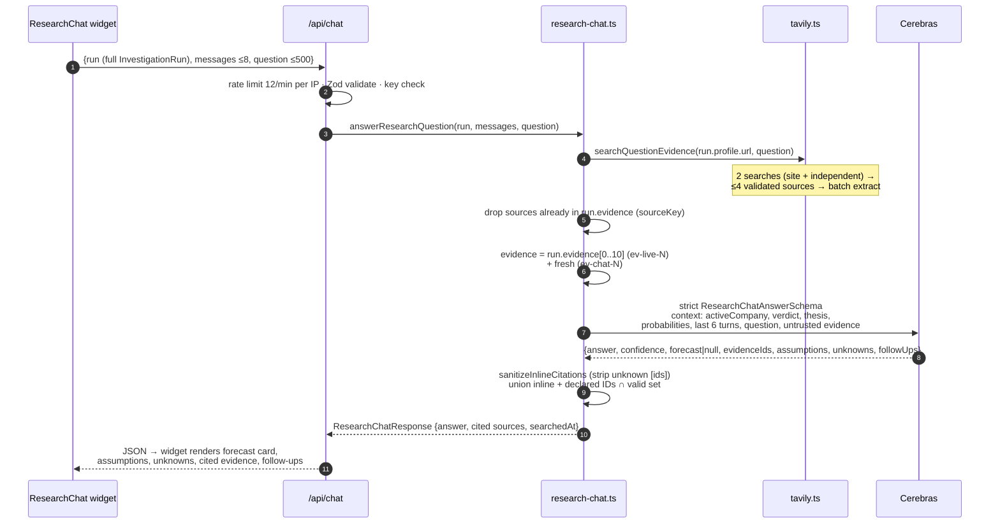
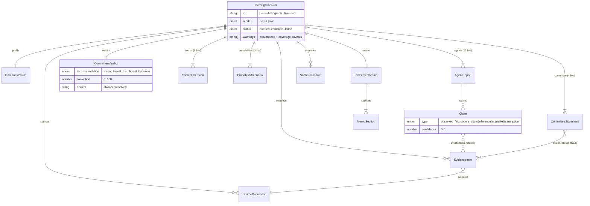
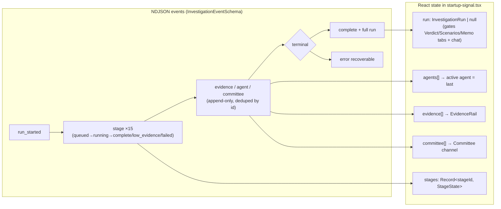

# StartupSignal V2 — Detailed Architecture (Claude)

Author: Claude (Fable 5) · Date: 2026-07-15
Companion to `docs/ARCHITECTURE.md`; this document goes deeper into module topology, request lifecycles, data contracts, and trust boundaries as implemented in the current code.

---

## 1. System overview

```mermaid
flowchart TB
  subgraph Client["Browser (Client Components)"]
    landing["Landing<br/>components/landing.tsx"]
    shell["StartupSignal shell<br/>components/startup-signal.tsx<br/>(state owner + NDJSON reader)"]
    workspace["Workspace<br/>components/workspace.tsx<br/>Investigation / Verdict / Stress tests / Memo"]
    chatui["ResearchChat widget<br/>components/research-chat.tsx<br/>(live mode only)"]
    landing --> shell --> workspace
    workspace --> chatui
  end

  subgraph Server["Next.js Node.js runtime (server-only)"]
    subgraph Routes["API routes (app/api)"]
      analyze["POST /api/analyze<br/>maxDuration 60 · NDJSON stream"]
      scenario["POST /api/scenario<br/>maxDuration 30 · JSON"]
      chat["POST /api/chat<br/>maxDuration 45 · JSON"]
    end
    subgraph Security["lib/security"]
      ratelimit["rate-limit.ts<br/>in-memory window per instance"]
      urlguard["url.ts<br/>normalizePublicUrl + assertPublicDestination"]
    end
    subgraph Evidence["Evidence acquisition"]
      crawler["lib/crawling/crawler.ts<br/>robots-aware bounded crawler<br/>≤4 pages · 500KB/page · 3 redirects · 8s/req"]
      tavily["lib/search/tavily.ts<br/>search + extract (server-only)"]
      contract["lib/search/tavily-contract.ts<br/>Zod response schemas + URL helpers"]
    end
    subgraph Synthesis["AI synthesis"]
      liveanalysis["lib/ai/live-analysis.ts<br/>3 concurrent packets + deterministic assembly"]
      researchchat["lib/ai/research-chat.ts<br/>question answering + citation sanitizing"]
      cerebras["lib/ai/cerebras.ts<br/>strict JSON-schema call + 1 repair"]
      schemaconv["lib/ai/cerebras-schema.ts<br/>Zod→JSON Schema ≤5,000 chars"]
      citations["lib/ai/research-chat-citations.ts"]
    end
    demo["lib/demo/heliograph.ts<br/>deterministic fictional dataset"]
    schemas["lib/schemas/*.ts<br/>investigation + research-chat (Zod)"]
    events["lib/orchestration/events.ts<br/>NDJSON event union + 15 pipeline stages"]
  end

  subgraph External["External services"]
    site["Target startup website<br/>(untrusted)"]
    tavilyapi["Tavily API<br/>api.tavily.com /search /extract"]
    cerebrasapi["Cerebras Cloud<br/>Chat Completions, strict JSON schema"]
  end

  shell -- "NDJSON stream" --> analyze
  workspace -- "run + counterfactual" --> scenario
  chatui -- "run + history + question" --> chat

  analyze --> ratelimit & urlguard
  analyze --> demo
  analyze --> crawler & tavily
  analyze --> liveanalysis
  scenario --> liveanalysis
  chat --> researchchat
  researchchat --> tavily & cerebras & citations
  liveanalysis --> cerebras
  cerebras --> schemaconv
  tavily --> contract & urlguard
  crawler --> urlguard

  crawler -- "HTTPS, manual redirects" --> site
  tavily -- "Bearer key, 14s timeout" --> tavilyapi
  cerebras -- "API key, 50s timeout" --> cerebrasapi

  classDef ext fill:#2b1d1d,stroke:#a55
  class site,tavilyapi,cerebrasapi ext
```



**Key properties**

- All secrets (`CEREBRAS_API_KEY`, `TAVILY_API_KEY`) are read lazily inside `server-only` modules; nothing is exposed via `NEXT_PUBLIC_`.
- Demo and live paths converge on one contract: `InvestigationRunSchema`. The client re-validates the completed run before trusting it.
- There is **no persistence layer**: the run lives in client React state; chat and scenario requests re-upload the whole validated run.

---

## 2. Live investigation lifecycle (`POST /api/analyze`)

```mermaid
sequenceDiagram
  autonumber
  participant B as Browser (startup-signal.tsx)
  participant A as /api/analyze
  participant G as url.ts guard
  participant C as crawler.ts
  participant T as tavily.ts
  participant L as live-analysis.ts
  participant X as Cerebras

  B->>A: POST {url, mode:"live"}
  A->>A: rate limit (6/min per IP) → 429 if exceeded
  A->>A: Zod AnalysisRequestSchema → 400 if invalid
  A-->>B: open NDJSON stream · run_started
  A->>G: normalizePublicUrl + assertPublicDestination (DNS)
  Note over G: http/https only · no creds · ports 80/443<br/>blocked hostnames · private/reserved IP ranges

  par Direct crawl
    A->>C: crawlCompany(url)
    C->>C: robots.txt (best-effort parse)
    C->>C: secureFetch homepage (manual redirects,<br/>re-guard per hop, 500KB cap, 8s timeout)
    alt HTTP 403/429 on homepage
      C->>C: sitemap.xml fallback → catalog-only sources
    else OK
      C->>C: cheerio strip script/style/iframe/svg/form<br/>follow ≤3 useful same-origin links
    end
  and Tavily enrichment
    A->>T: searchCompanyEvidence(url)
    T->>T: 2 searches: site-restricted + independent<br/>(social/UGC domains excluded)
    T->>G: per-result normalize + DNS re-check
    T->>T: dedupe → ≤6 → batch /extract (2 chunks/source)
  end

  A->>A: merge + dedupe by sourceKey → ≤10 sources
  A-->>B: stage events (discovery/website/market status)
  A->>L: analyzeSources(canonicalUrl, sources, warnings)
  Note over L: corpus fenced as UNTRUSTED SOURCE DATA,<br/>&lt; &gt; escaped, evidence IDs ev-live-N

  par 3 concurrent structured calls
    L->>X: intelligence packet (profile + 13 agents, 5.5k tok)
    L->>X: decision packet (committee + verdict + scores + probabilities, 3.5k tok)
    L->>X: memo packet (6 sections + warnings, 2.5k tok)
  end
  Note over X: strict JSON schema ≤5,000 chars ·<br/>on parse/Zod failure: 1 repair retry (strict:false, temp 0.35)

  L->>L: normalize to fixed counts (13/4/8/3) with placeholders
  L->>L: if sitemap-only corpus → force Insufficient Evidence
  L->>L: filter claim/committee evidence IDs · assemble run
  A->>A: InvestigationRunSchema.parse (final gate)
  A-->>B: evidence · agent · committee · stage events
  A-->>B: complete {run} → client re-validates with Zod
```

**Failure semantics:** any thrown error becomes a single `{type:"error", recoverable:true}` event; `Promise.allSettled` lets either evidence branch fail independently, and warnings ride along inside the run rather than aborting it.

---

## 3. Research chat lifecycle (`POST /api/chat`)



The scenario route (`POST /api/scenario`) is the same shape without retrieval: demo mode pattern-matches canned `ScenarioUpdate`s; live mode sends `{scenario, verdict, scores, probabilities, thesis, evidenceIds}` to one strict Cerebras call and returns a `ScenarioUpdate` that the **client** merges into its local run state (deltas applied to conviction/confidence, probability ranges overwritten, memo change log appended).

---

## 4. Trust boundaries

```mermaid
flowchart LR
  subgraph Z0["Zone 0 — Attacker-influenced"]
    userurl["Submitted URL"]
    sitehtml["Fetched site HTML / sitemaps"]
    tavtext["Tavily excerpts & extractions"]
    clientrun["Client-supplied run<br/>(chat & scenario bodies)"]
  end

  subgraph Z1["Zone 1 — Server validation"]
    norm["URL normalize<br/>scheme/port/creds/host checks"]
    dns["DNS resolve → private-range denylist<br/>(re-checked per redirect & per Tavily URL)"]
    bounds["Byte / page / redirect / time caps"]
    inert["cheerio strip active content<br/>cleanTavilyContent strips tags & control chars"]
    zreq["Zod request schemas"]
  end

  subgraph Z2["Zone 2 — Model boundary"]
    fence["UNTRUSTED SOURCE DATA fencing<br/>&lt;&gt; escaped · instruction hierarchy"]
    strict["Strict JSON-schema decoding"]
  end

  subgraph Z3["Zone 3 — Post-model gates"]
    zval["Independent Zod re-validation"]
    detass["Deterministic assembly:<br/>fixed IDs, counts, timestamps"]
    evfilter["Evidence-ID filtering<br/>(claims, committee, chat citations)"]
    sitemaplock["Sitemap-only ⇒ forced<br/>Insufficient Evidence"]
  end

  subgraph Z4["Zone 4 — Client"]
    revalidate["Client Zod re-parse of run/events"]
    react["React-escaped rendering<br/>(no dangerouslySetInnerHTML)"]
  end

  userurl --> norm --> dns --> bounds
  sitehtml --> bounds --> inert
  tavtext --> inert
  clientrun --> zreq
  inert --> fence --> strict --> zval --> detass --> evfilter --> sitemaplock --> revalidate --> react
  zreq --> fence
```



**Residual gaps** (detailed in `Claude_suggestions_v1.md`): DNS check and actual fetch resolve independently (rebinding window); chat/scenario accept any schema-valid run regardless of `mode`/`status`; memo-section evidence IDs bypass the ID filter; rate limiting is per-warm-instance and keyed on `x-forwarded-for`.

---

## 5. Data model (core contracts)



**Provider-facing vs authoritative schemas.** `live-analysis.ts` sends *relaxed* packet schemas to Cerebras (arrays without exact-length constraints, since `cerebras-schema.ts` strips `minItems`/`maxItems`/`pattern` etc. to fit the 5,000-char strict limit), then re-imposes exact counts (13 agents, 4 statements, 8 scores, 3 probabilities) with deterministic placeholder backfill before parsing against the strict internal schemas. IDs (`discovery-agent`, `committee-1`, `score-1`, `ev-live-N`) are always assigned server-side, never trusted from the model.

---

## 6. Event & state flow (client)



The 15 pipeline stages (`lib/orchestration/events.ts`) map 1:1 to the sidebar; live mode fills most of them in a burst after synthesis completes, since agents are only known post-hoc. `ScenarioView` mutates the run locally via `setRun`; nothing round-trips to a server store.

---

## 7. Deployment & runtime constraints

| Concern | Current implementation | Notes |
| --- | --- | --- |
| Runtime | Node.js route handlers (`runtime = "nodejs"`), Vercel-oriented | Needed for `node:dns`, `node:net`, Cerebras SDK |
| Time budget | analyze 60s · chat 45s · scenario 30s | Cerebras client timeout 50s + 1 retry can exceed the analyze budget (see suggestions #2) |
| State | None server-side; run lives in browser memory | Refresh loses the run; chat/scenario re-upload it |
| Rate limiting | In-memory map per warm instance (6/12/10 per min per IP) | Best-effort only; documented |
| Secrets | `CEREBRAS_API_KEY`, `TAVILY_API_KEY`, optional `CEREBRAS_MODEL` | Lazily read server-side; demo path needs none |
| Evidence caps | ≤4 crawled pages (500KB, 12k chars text each) + ≤6 Tavily sources (4k chars each) → ≤10 merged | Chat adds ≤4 question-specific sources |
| Testing | Vitest: URL guard, crawler parsing, Tavily contract, schema conversion, citation sanitizer, schemas | 46 tests; no route-level/integration tests |
