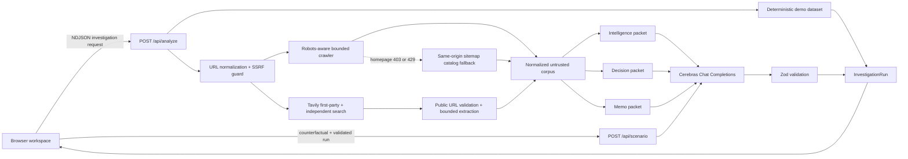
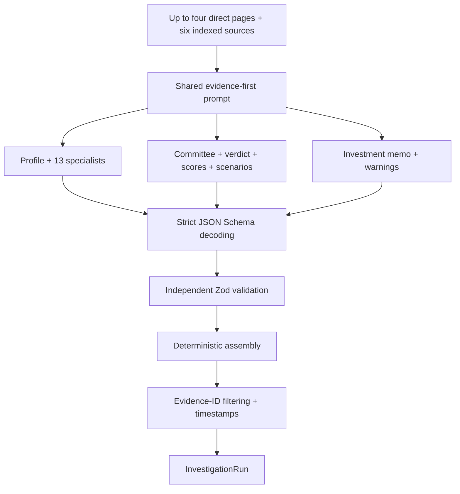
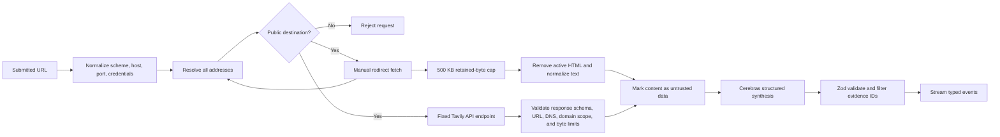

# StartupSignal V2 Architecture

StartupSignal V2 is a Next.js App Router application that turns a company URL into a typed investment investigation. The browser renders a progressive command-center workspace. Crawling, URL security, provider access, and secrets remain in Node.js server routes. Demo and live paths converge on the same `InvestigationRun` schema.

## System

The analysis route opens an NDJSON stream immediately. Demo mode emits deterministic staged events. Live mode runs the secure crawler and Tavily retrieval concurrently after the submitted destination passes public-network validation. It then launches three Cerebras structured-output calls concurrently, validates every packet, assembles the common run contract, and emits evidence, agents, committee statements, and the final verdict.

## Provider Boundary

The complete investigation schema exceeds Cerebras's 5,000-character strict-schema limit. V2 partitions it into three smaller schemas and executes them concurrently. Unsupported JSON Schema constraints are removed from the provider schema, every object is closed with `additionalProperties: false`, and the original Zod constraints remain authoritative after generation. One clean repair attempt is allowed per packet.

## Trust Boundary

The provider keys are read lazily from `CEREBRAS_API_KEY` and `TAVILY_API_KEY` inside server-only modules. They are never exposed through `NEXT_PUBLIC_` variables. Direct page crawling remains the primary first-party connector. Tavily adds at most three domain-restricted and three independent sources; social and UGC domains are excluded from the independent query. For HTTP 403/429 homepages, a bounded sitemap fallback may add URL catalogs while Tavily attempts substantive retrieval. If no substantive sources are recovered, deterministic post-processing forces `Insufficient Evidence`.

## Serverless Constraints

| Area | Current design | Production extension |
| --- | --- | --- |
| Execution | One bounded request, `maxDuration = 60` | Durable queue and resumable run state |
| Persistence | Client memory | Database-backed investigations and memo versions |
| Rate limits | Per-instance memory | Distributed Vercel KV or equivalent |
| Evidence | Four direct pages or sitemap catalogs, plus six Tavily sources | Audited paid datasets, repositories, and data-room connectors |
| Demo | Keyless fictional dataset | Keep as deterministic incident and sales fallback |

The scenario endpoint accepts a validated completed run and a bounded counterfactual. Demo scenarios are deterministic. Live scenarios use the same Cerebras strict-output helper without gathering or inventing new evidence.
